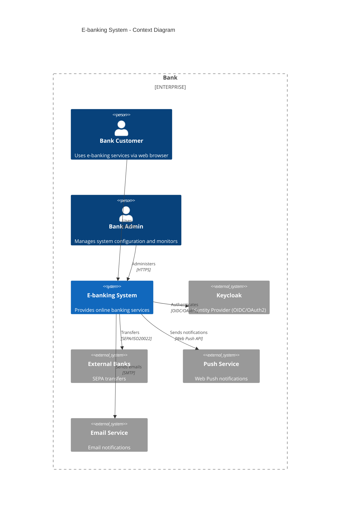
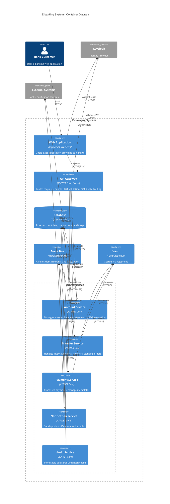
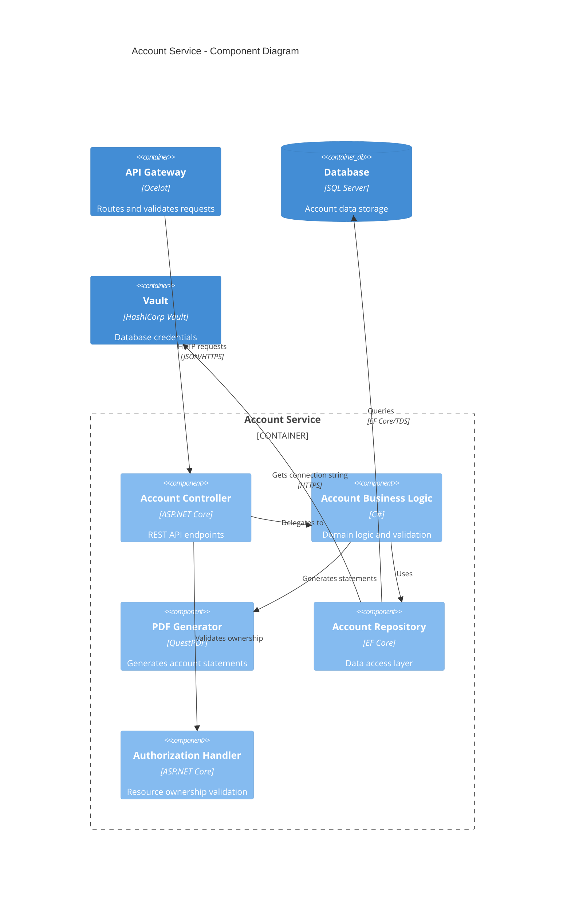
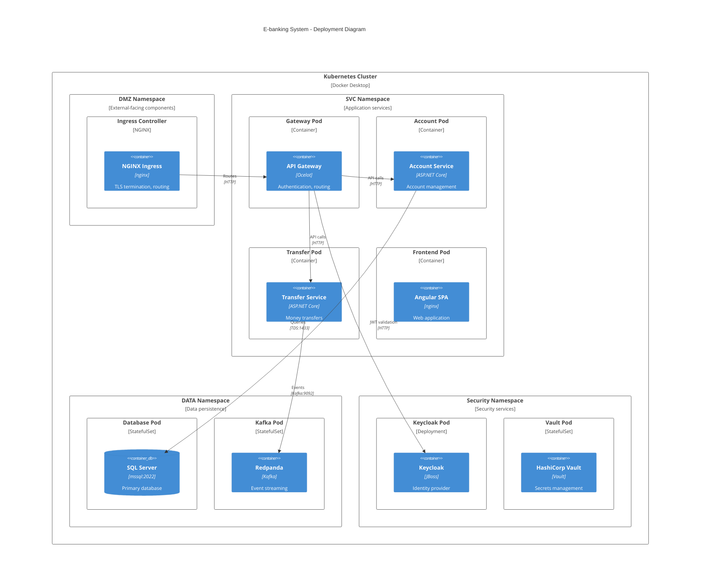

# C4 Architecture Diagrams

## Context Diagram
This shows the high-level system context and external actors.

## Container Diagram
This shows the high-level technical containers and their interactions.

## Component Diagram - Account Service
This shows the internal structure of the Account Service.

## Deployment Diagram
This shows how the system is deployed in Kubernetes.

## Security Boundaries

### Trust Zones
1. **DMZ (Demilitarized Zone)**: Ingress controller, exposed to internet
2. **SVC (Service Zone)**: Application services, internal communication
3. **DATA**: Databases and persistent storage
4. **Security**: Identity and secrets management

### Network Policies
- Default deny all traffic
- Explicit allow rules for required communication paths
- Ingress can only reach Gateway
- Services can only reach databases they need
- All services can reach Vault and Keycloak

### Data Flow Security
1. **External → DMZ**: HTTPS with TLS certificates
2. **DMZ → SVC**: HTTP over private network with JWT validation
3. **SVC → DATA**: Encrypted connections with service accounts
4. **SVC → Security**: mTLS for vault, HTTPS for Keycloak

## Technology Choices

### Frontend
- **Angular 20**: Modern SPA framework with excellent TypeScript support
- **PKCE Flow**: Secure authentication for SPAs
- **Service Worker**: For push notifications and offline capability

### Backend
- **ASP.NET Core 8**: High-performance, secure web framework
- **Minimal APIs**: Lightweight API development
- **Entity Framework Core**: Type-safe data access
- **Ocelot**: Feature-rich API gateway

### Infrastructure
- **Kubernetes**: Container orchestration
- **SQL Server 2022**: Enterprise-grade relational database
- **Kafka/Redpanda**: Event streaming and messaging
- **Keycloak**: Open-source identity management
- **HashiCorp Vault**: Secrets management

### Security
- **JWT**: Stateless authentication
- **HTTPS Everywhere**: TLS for all communications
- **Network Policies**: Microsegmentation
- **RBAC**: Role-based access control
